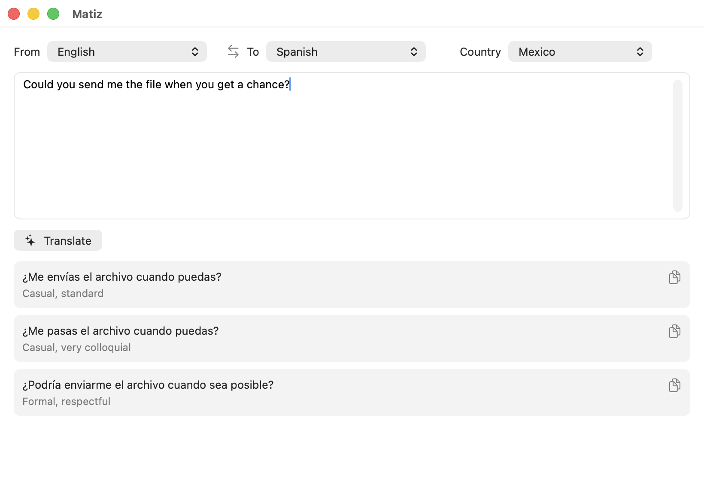

<picture>
  <source media="(prefers-color-scheme: dark)" srcset="docs/banner-dark.svg">
  
</picture>

A small macOS translation app. Give it a source string, a source language, a target
language and a country, and it returns 1–3 translation variants, each with a short
note ("more formal", "casual, spoken", …) so you can pick the right register for the
right place.

<p align="center">
  
</p>

Translations are generated by the [Claude Code CLI](https://docs.anthropic.com/en/docs/claude-code)
(`claude -p`), so that must be installed and logged in.

## Run

```bash
swift run Matiz
```

The model used (Haiku by default) can be changed in Settings (⌘,).

## Install

```bash
bin/install
```

Builds a release `Matiz.app` and installs it to `~/Applications`.

## Test

```bash
swift run matiz-tests
```

## Regenerating

```bash
swift tools/generate_icon.swift   # redraws the app icon
python3 tools/generate_db.py      # rebuilds the embedded country/language data
bin/screenshot                    # recaptures the screenshot above
```

The country/language data comes from Google Translate's supported languages and the
spoken-in mappings in Unicode CLDR. The screenshot shows a real translation, so
recapture it if the variants stop showing the register differences well.
